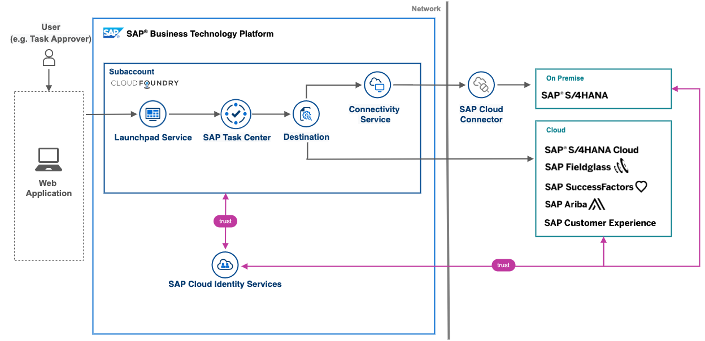

# IN264 - Enable, Configure, and Integrate a Central Inbox on SAP BTP

## Description

This repository contains the material for the SAP TechEd 2022 session "IN264 - Enable, Configure, and Integrate a Central Inbox on SAP BTP."

## Overview

As part of our integration strategy, "One Workflow Inbox" is one of our suite qualities. The resulting product – SAP Task Center service on SAP Business Technology Platform (SAP BTP) – provides a central inbox across SAP solutions. Learn the building blocks and how to implement this integration scenario, from setting up SAP Task Center on SAP BTP, to configuring the connection with SAP S/4HANA and using the SAP Mobile Start app as a native entry point for mobile access. 

## Requirements

The requirements to follow the exercises in this repository are knowledge about:

- SAP BTP Platform concepts
- SAP BTP Launchpad setup and configuration
- SAP Cloud Identity Services

## Exercises

Provide the exercise content here directly in README.md using [markdown](https://guides.github.com/features/mastering-markdown/) and linking to the specific exercise pages, below is an example.

- [Getting Started, check the environment and system access](exercises/ex0/)
- [Exercise 1 - Configure your BTP subaccount and enable SAP Task Center](exercises/ex1/)
    - [Exercise 1.1 - Build the trust between your BTP subaccount and SAP Cloud Identity Services](exercises/ex1#exercise-11-sub-exercise-1-description)
    - [Exercise 1.2 - Run the BTP Booster for setting up SAP Task Center](exercises/ex1#exercise-12-sub-exercise-2-description)
    - [Exercise 1.3 - Manage users & assign roles](exercises/ex1#exercise-13-sub-exercise-3-description)
- [Exercise 2 - Configure and run SAP Task Center](exercises/ex2/)
    - [Exercise 2.1 - Exercise 2 Sub Exercise 1 Description](exercises/ex2#exercise-21-sub-exercise-1-description)
    - [Exercise 2.2 - Exercise 2 Sub Exercise 2 Description](exercises/ex2#exercise-22-sub-exercise-2-description)

  
**OR** Link to the Tutorial Navigator for example...

Start the exercises [here](https://developers.sap.com/tutorials/abap-environment-trial-onboarding.html).

**IMPORTANT**

Your repo must contain the .reuse and LICENSES folder and the License section below. DO NOT REMOVE the section or folders/files. Also, remove all unused template assets(images, folders, etc) from the exercises folder. 

## How to obtain support

Support for the content in this repository is available during the actual time of the online session for which this content has been designed. Otherwise, you may request support via the [Issues](../../issues) tab.

## License
Copyright (c) 2022 SAP SE or an SAP affiliate company. All rights reserved. This project is licensed under the Apache Software License, version 2.0 except as noted otherwise in the [LICENSE](LICENSES/Apache-2.0.txt) file.
