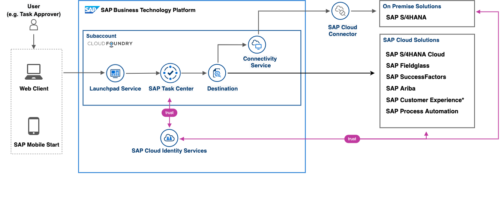
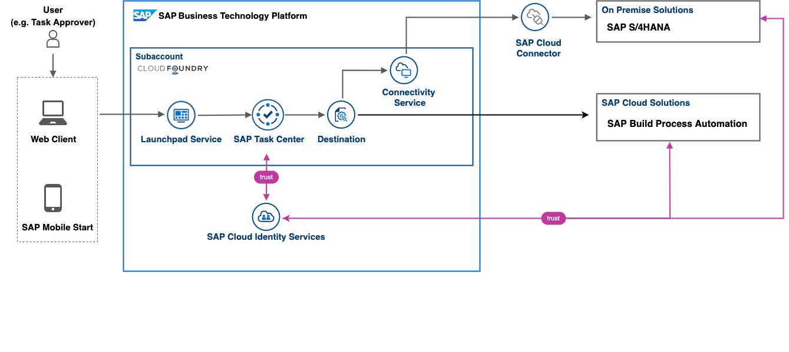

# IN264 - Enable, Configure, and Integrate a Central Inbox on SAP BTP

## Description

This repository contains the material for the SAP TechEd 2022 session "IN264 - Enable, Configure, and Integrate a Central Inbox on SAP BTP."

## Overview

As part of our integration strategy, "One Workflow Inbox" is one of our suite qualities. The resulting product – SAP Task Center service on SAP Business Technology Platform (SAP BTP) – provides a central inbox across SAP solutions. Learn the building blocks and how to implement this integration scenario, from setting up SAP Task Center on SAP BTP, to configuring the connection with SAP S/4HANA and using the SAP Mobile Start app as a native entry point for mobile access. 

## Scenario

In this Hands-On we will integrate two "Task Providers":

- SAP S/4HANA On Premise
- SAP BTP Process Automation

In addition we will make use and configure other BTP componetents for running this scenario End-to-End sucessfully.

## Requirements

The requirements to follow the exercises in this repository are knowledge about:

- [SAP Business Technologie Platform concepts](https://help.sap.com/docs/BTP/65de2977205c403bbc107264b8eccf4b/73beb06e127f4e47b849aa95344aabe1.html)
- [SAP Launchpad service](https://help.sap.com/docs/Launchpad_Service/8c8e1958338140699bd4811b37b82ece/9db48fa44f7e4c62a01bc74c82e74e07.html)
- [SAP Cloud Identity Services](https://help.sap.com/docs/SAP_CLOUD_IDENTITY)

## Exercises

- [Getting Started & check your hands-on environment ](exercises/ex0/)
- [Exercise 1 - Enable SAP Task Center](exercises/ex1/)
    - [Exercise 1.1 - (Option A) Run the BTP Booster for setting up SAP Task Center](exercises/ex1/README.md#exercise-11-execute-the-sap-task-center-booster)
    - [Exercise 1.2 - (Option B) Enable SAP Task Center manually](exercises/ex1/README.md#exercise-12-enable-sap-task-center-manually)
    - [Exercise 1.3 - Integrate the SAP Task Center service into SAP BTP Launchpad ](exercises/ex1/README.md#exercise-13-integrate-the-sap-task-center-service-into-sap-btp-launchpad)
    - [Exercise 1.4 - Enable Single-Sign-On (SSO) for SAP Task Center](exercises/ex1/README.md#exercise-14-enable-single-sign-on-sso-for-sap-task-center)
    - [Summary](exercises/ex1/README.md#summary)
- [Exercise 2 - Integrate SAP S/4HANA as task provider](exercises/ex2/README.md)
    - [Exercise 2.1 - Create S4HOP Destination](exercises/ex2/README.md#exercise-21-sub-exercise-1-description)
    - [Exercise 2.2 - Check S/4HANA connectivity via Task Center Admin app](exercises/ex2/README.md#exercise-22-sub-exercise-2-description)
    - [Exercise 2.3 - Update UUID](exercises/ex2/README.md#exercise-22-sub-exercise-2-description)
- [Exercise 3 - Integrate SAP Process Automation as task provider](exercises/ex3/README.md)
    - [Exercise 3.1 - Create SPA Destination](exercises/ex3/README.md#exercise-31-sub-exercise-1-description)
    - [Exercise 3.2 - Check SPA connectivity via Task Center Admin app](exercises/ex2/README.md#exercise-22-sub-exercise-2-description)
- [Exercise 4 - Check the Workflow as](exercises/ex2/README.md#exercise-22-sub-exercise-2-description)   
- [Exercise 5 - Connect Mobile Start](exercises/ex2/README.md#exercise-22-sub-exercise-2-description)
- [Demo: BTP Setup Automator](https://github.com/SAP-samples/btp-setup-automator)
- [Troubleshooting](exercises/ex2/)
- [Additional ressources](exercises/ex2/)

  
**OR** Link to the Tutorial Navigator for example...

Start the exercises [here](https://developers.sap.com/tutorials/abap-environment-trial-onboarding.html).

**IMPORTANT**

Your repo must contain the .reuse and LICENSES folder and the License section below. DO NOT REMOVE the section or folders/files. Also, remove all unused template assets(images, folders, etc) from the exercises folder. 

## How to obtain support

Support for the content in this repository is available during the actual time of the online session for which this content has been designed. Otherwise, you may request support via the [Issues](../../issues) tab.

## License
Copyright (c) 2022 SAP SE or an SAP affiliate company. All rights reserved. This project is licensed under the Apache Software License, version 2.0 except as noted otherwise in the [LICENSE](LICENSES/Apache-2.0.txt) file.
