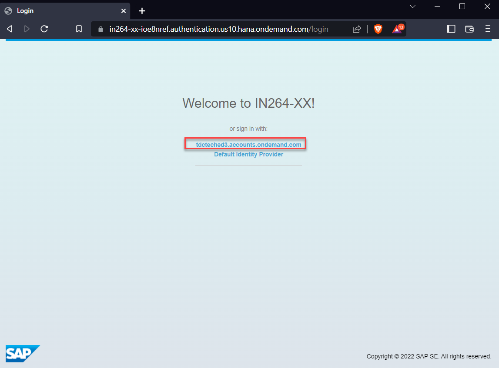
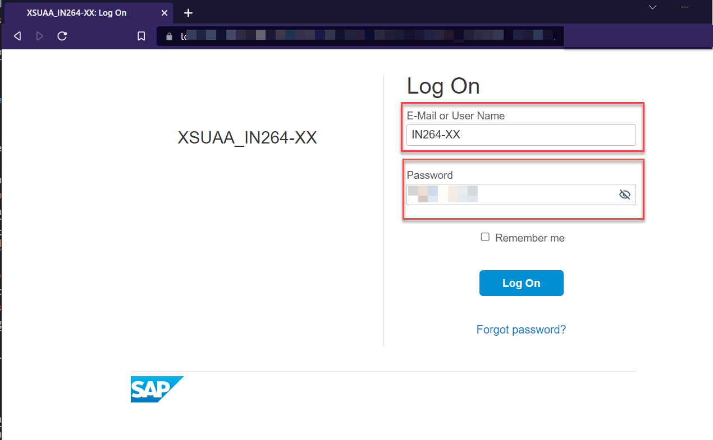
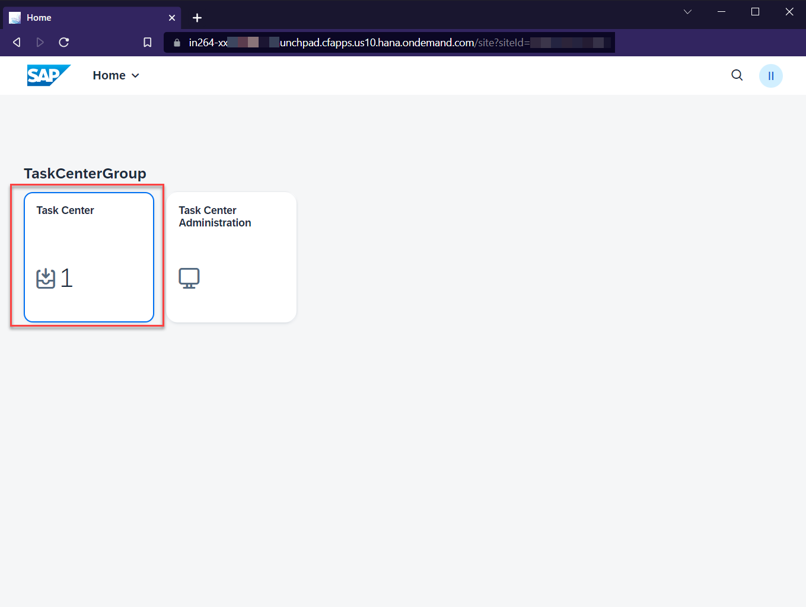
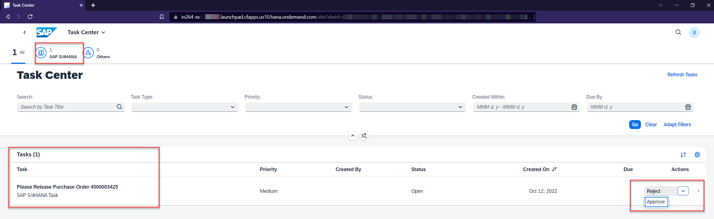

# Exercise 4 - Check the task workflow as business user (task approver) 👩‍💼

In this exercise you validate the scenario and check from an end-user perspective.
Thus, before you have to provide access to the user meant to represent the business user (task approver; user = IN264-XX  👩‍💼)

> ℹ Please use URL for the Launchpad site you created in exercise  [Integrate the SAP Task Center service into SAP BTP Launchpad - Step 10](/exercises/ex1/README.md#exercise-13-integrate-the-sap-task-center-service-into-sap-btp-launchpad)

### Access SAP Launchpad Service as Business User (Task Approver)

> ⚠ Please open a new incognito browser window and make sure that you are logged off all active sessions!!

1. Access the Launchpad site; the URL should follow a pattern like: 
[*https://in264-xx-<...>.launchpad.cfapps.us10.hana.ondemand.com/site?siteId=<...>#Shell-home*](https://in264-xx-<...>.launchpad.cfapps.us10.hana.ondemand.com/site?siteId=<...>#Shell-home)  
Select "[tdcteched3.accounts.ondemand.com](tdcteched3.accounts.ondemand.com)"

2. Select the the certificate created in exercise [Enable Single-Sign-On (SSO) for SAP Task Center](/exercises/ex1/README.md#exercise-14-enable-single-sign-on-sso-for-sap-task-center)  
//TODO enter certificate selection  
Or  
Enter user credentials for business user (task approver; user = IN264-XX  👩‍💼)  
  
The Task Center application(s) should be displayed on your HOME screen of the Launchpad site and the number of assigned tasks should show up

3. Enter the "Task Center" application to display details of assigned tasks and possible workflow actions, approval or rejection or access further details of the task.

> ℹ The shown systems and assigned tasks depends on your previous exercises

🎉🙌🥳 **Congratulations you successfully enabled, configured, and integrated a Central Inbox on SAP Business Technology Platform leveraging SAP TAsk Center service.** 🎉🙌🥳