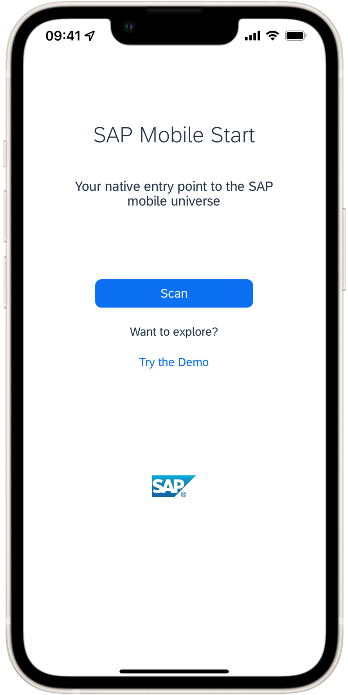

# Exercise 5 - Connect SAP Mobile Start 📱

Here are the steps to enable **SAP Mobile Start** for mobile access for SAP Task Center.
This exercise is optional and 

1. Open Launchpad site, click on your user profile in the upper right corner and click on 'Settings'  

2. Select the tab 'SAP Mobile Start Application'

    
3. Based on the mobile device used scan the respective QR code to install the mobile application or use the respective links for installing SAP Mobile Start from the respective app store ([iOS - Apple App Store](https://apps.apple.com/de/app/sap-mobile-start/id1540195902?l=en) or [Android - Google Play](https://play.google.com/store/apps/details?id=com.sap.mobile.apps.sapstart&hl=de&gl=US))

4. Click on the 'Register' tab 

and scan the QR code to register the mobile application from our SAP Mobile Start application
  

5. Select "[tdcteched3.accounts.ondemand.com](tdcteched3.accounts.ondemand.com)"
  

6. Enter user credentials for business user (task approver; user = IN264-XX  👩‍💼)  

7. Accept End User License agreement and Data Privacy Terms

As result, SAP Mobile Start Application shows up with respective tasks from SAP Task Center service (see **"To-Do"** section)

